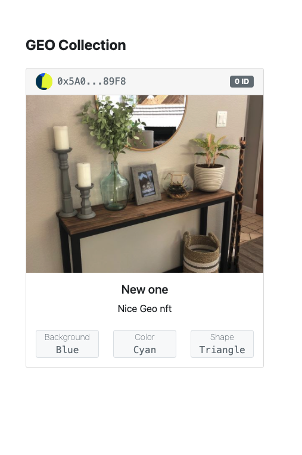

<div id="top"></div>


[![Contributors][contributors-shield]][contributors-url]
[![Forks][forks-shield]][forks-url]
[![Stargazers][stars-shield]][stars-url]
[![Issues][issues-shield]][issues-url]
[![MIT License][license-shield]][license-url]


<!-- PROJECT LOGO -->
<br />
<div align="center">

[//]: # (  <a href="https://github.com/othneildrew/Best-README-Template">)

[//]: # (    )

[//]: # (  </a>)

<h3 align="center">GEO Collection</h3>

  <p align="center">
   An awesome NFT minter built on the Celo blockchain
    <br />
    <br />
    <a href="#">View Demo</a>
    ·
    <a href="https://github.com/dacadeorg/celo-nft-minter/issues">Report Bug</a>
    ·
    <a href="https://github.com/dacadeorg/celo-nft-minter/issues">Request Feature</a>
  </p>
</div>


<!-- TABLE OF CONTENTS -->
<details>
  <summary>Table of Contents</summary>
  <ol>
    <li>
      <a href="#about-the-project">About The Project</a>
      <ul>
        <li><a href="#built-with">Built With</a></li>
      </ul>
    </li>
    <li>
      <a href="#getting-started">Getting Started</a>
      <ul>
        <li><a href="#prerequisites">Prerequisites</a></li>
        <li><a href="#installation">Installation</a></li>
        <li><a href="#Smart-Contract-Deployment">Smart Contract Deployment</a></li>
      </ul>
    </li>
    <li><a href="#contributing">Contributing</a></li>
    <li><a href="#license">License</a></li>
    <li><a href="#contact">Contact</a></li>

  </ol>
</details>


<!-- ABOUT THE PROJECT -->

## About The Project

[![Celo Minter][product-screenshot]]("product-screenshot")

NFT minter is a decentralized application that enables users view and mint NFTs to an address. These NFTs are minted on
the Celo blockchain and its metadata are saved on IPFS(InterPlanetary File System)


<div align="center">
   
</div>
<p align="right">(<a href="#top">back to top</a>)</p>


### :man_technologist: Technologies

Frameworks and libraries used in this project include:

* [React.js](https://reactjs.org/)
* [Hardhat](https://hardhat.org/getting-started/)
* [Solidity](https://docs.soliditylang.org/en/v0.8.11/)
* [Openzeppelin](https://openzeppelin.com/)
* [Bootstrap](https://getbootstrap.com)
* [Celo-tools](https://docs.celo.org/learn/developer-tools)

<p align="right">(<a href="#top">back to top</a>)</p>


<!-- GETTING STARTED -->

## :point_down: Getting Started

To get this project up running locally, follow these simple example steps.

### Prerequisites

You will need node installed. If you do not have node installed, you can install it with the command below.

* npm
  ```sh
  npm install npm@latest -g
  ```

### Installation

Step-by-step guide to running this NFT minter locally;

1. Clone the repo
   ```sh
   git clone https://github.com/dacadeorg/celo-nft-minter.git
   ```
2. Install NPM packages
   ```sh
   npm install
   ```
3. Install Hardhat
   ```sh
   npm install --save-dev hardhat
   ```

3. Run your application
   ```sh
   npm run start
   ```

### Smart-Contract-Deployment

Step-by-step guide to redeploying the NFT smart contract using your address to enable you mint NFTs.

1. Compile the smart contract
   ```sh
   npx hardhat compile
   ```
2. Run tests on smart contract
   ```sh
   npx hardhat test
   ```
3. Update env file

* Create a file in the root directory called ".env"
* Create a key called MNEMONIC and paste in your mnemonic key. e.g
     ```js
   MNEMONIC=asdasd adeew grege egegs nbrebe fwf vwefwf wvwvwv wevw vbtbtr wcvd
   ```

4. Deploy the smart contract
   ```sh
    npx hardhat run scripts/deploy.js
   ```
5. Run the project
   ```sh
    npm run start
   ```

<p align="right">(<a href="#top">back to top</a>)</p>


<!-- CONTRIBUTING -->

## :writing_hand: Contributing

Contributions are what make the open source community such an amazing place to learn, inspire, and create. Any
contributions you make are **greatly appreciated**.

If you have a suggestion that would make this better, please fork the repo and create a pull request. You can also
simply open an issue with the tag "enhancement". Don't forget to give the project a star! Thanks again!

1. Fork the Project
2. Create your Feature Branch (`git checkout -b feature/AmazingFeature`)
3. Commit your Changes (`git commit -m 'Add some AmazingFeature'`)
4. Push to the Branch (`git push origin feature/AmazingFeature`)
5. Open a Pull Request

<p align="right">(<a href="#top">back to top</a>)</p>


<!-- LICENSE -->

## :policeman: License

Distributed under the MIT License. See `LICENSE.txt` for more information.

<p align="right">(<a href="#top">back to top</a>)</p>


<!-- CONTACT -->

## :iphone: Contact

Visit us at - [Dacade](https://dacade.org)

<p align="right">(<a href="#top">back to top</a>)</p>


<!-- MARKDOWN LINKS & IMAGES -->
<!-- https://www.markdownguide.org/basic-syntax/#reference-style-links -->

[contributors-shield]: https://img.shields.io/github/contributors/dacadeorg/celo-nft-minter.svg?style=for-the-badge

[contributors-url]: https://github.com/dacadeorg/celo-nft-minter/graphs/contributors

[forks-shield]: https://img.shields.io/github/forks/dacadeorg/celo-nft-minter.svg?style=for-the-badge

[forks-url]: https://github.com/dacadeorg/celo-nft-minter/network/members

[stars-shield]: https://img.shields.io/github/stars/dacadeorg/celo-nft-minter.svg?style=for-the-badge

[stars-url]: https://github.com/dacadeorg/celo-nft-minter/stargazers

[issues-shield]: https://img.shields.io/github/issues/dacadeorg/celo-nft-minter.svg?style=for-the-badge

[issues-url]: https://github.com/dacadeorg/celo-nft-minter/issues

[license-shield]: https://img.shields.io/github/license/dacadeorg/celo-nft-minter.svg?style=for-the-badge

[license-url]: ./README/LICENSE.txt

[product-screenshot]: ./README/images/shot1.png

[product-screenshot-2]: ./README/images/shot2.png
